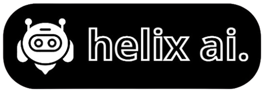

# Bem-vindo ao HELIX AI



Uma IA criada com TensorFlow para ser usada em ambientes onde ela possa detectar padrões e responder perguntas.

## Instruções de Uso

1. **Instale o Python**: Certifique-se de ter a versão mais recente do Python instalada no seu sistema.

2. **Clone o Repositório**: No terminal do bash, navegue até o diretório onde deseja clonar o repositório e execute:

    ```bash
    git clone https://github.com/Welpeth/helix-ai
    ```

2. **Navegue até o Repositório Clonado**: No terminal do bash de cd no helix-ai:

    ```bash
    cd helix-ai
    ```

3. **Instale as Dependências**: Instale as dependências necessárias com os seguintes comandos:

    ```bash
    pip install -r requirements.txt
    pip install scikit-learn gensim keras tensorflow spacy flask unidecode nltk
    python -m spacy download pt_core_news_lg
    ```

4. **Execute o Treinamento**: Com as dependências instaladas, você pode iniciar o Helix AI, voltando para a pasta principal e executando:

    ```bash
    cd ..
    python model_training.py
    ```
5. **Execute o Aplicativo**: Com as dependências instaladas, e o Helix AI pronto, volte para a pasta Flask_Application execute:

    ```bash
    cd Flask_Application
    python app.py
    ```

6. **Abra no navegador**: Com tudo pronto e o app.py funcionando perfeitamente abra no localhost:

    ```
    127.0.0.1:5000
    ```

Agora você pode usar o Helix AI para detectar padrões e responder perguntas.
